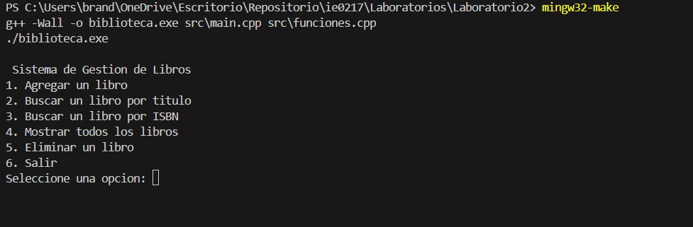

# Códigos elaborados en el laboratorio 2

## Instrucciones

Intrucciones para correr el código.

## Paso 1.

Accesar a la terminal.

## Paso 2.

Ir al directorio de los archivos.

```bash
cd <direccion>
```

## Paso 3.

Correr el archivo Makefile creado.

```bash
mingw32-make
```

# Códigos ejecutados:

