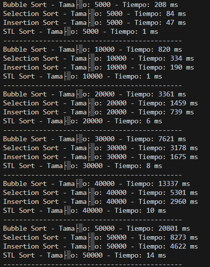

# Códigos elaborados en el laboratorio 5

## Instrucciones

Intrucciones para correr el código.

### Paso 1.

Accesar a la terminal.

### Paso 2.

Ir al directorio de los códigos.

```bash
cd <direccion>
```

### Paso 2.

Crear un archivo ejecutable(.exe) y copilar el código en lenguaje C++ a correr.

```bash
g++ -o .\<nombre_ejecutable.exe> .\<nombre_archivo_codigo.cpp> .\<nombre_archivo_codigo.hpp>
```

### Paso 3.

Correr el archivo ejecutable creado.

```bash
.\<nombre_ejecutable.exe>
```

# Códigos ejecutados

