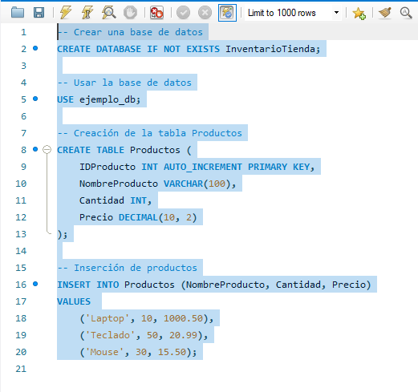
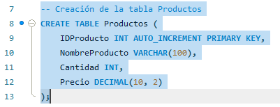
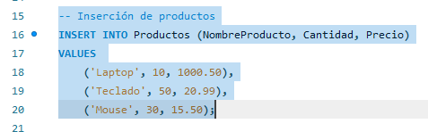
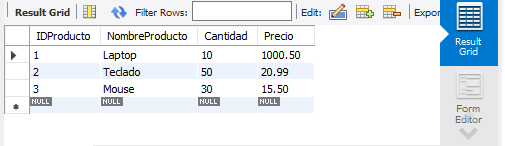
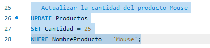
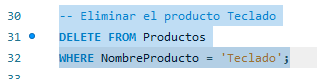
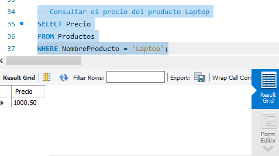
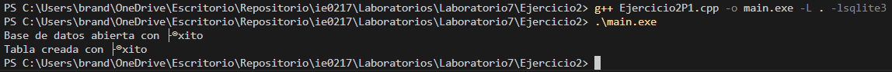
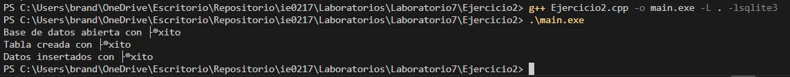
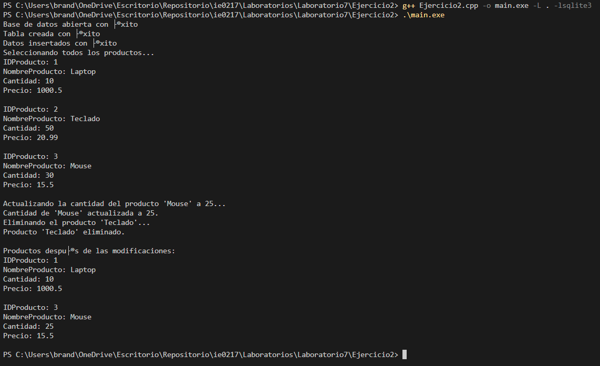

# Ejercicio 1

## Ventajas de un DBMS como MySQL frente a métodos tradicionales.

    - Los datos se almacenan y se mantienen de forma coherente.

    - Se puede realizar consultas complejas y rápidas a los datos.

    - MySQL puede manejar grandes cantidades de datos.

    - Múltiples usuarios puedan trabajar con los mismos datos al mismo tiempo.

    - Maneja la concurrencia.

## Gestión de concurrencia.
    - MySQL hace bloqueos y transacciones para gestionar la concurrencia cuando varios usuarios intentan modificar el mismo dato simultáneamente para que no se modifiquen datos al mismo tiempo.

# Ejercicio 2
## Parte 1:

## Parte 2:

## Parte 3 y 4:

