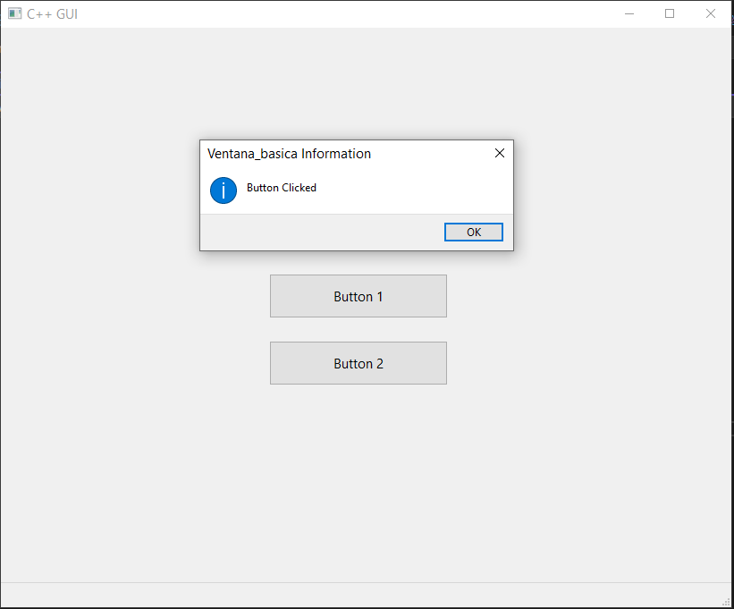

# Ejemplos de códigos elaborados en la sesión 10

## Contenido

- Introducción a las Interfaces Gráficas (GUI)
- Comparativa: WxWidgets vs FLTK
- Instalación y Configuración de WxWidgets
- Hello World en WxWidgets
- Creación de Ventanas Básicas
- Controles en WxWidgets
- Estilos de Controles
- Manejo de Eventos (Estático y Dinámico)
- Propagación de Eventos
- Eventos del Mouse y Teclado
- Siguientes Pasos: Layouts con wxBoxSizer y wxGridSizer

# Ejecución de ventanas:

Hello World in wxWidget:

Creando una ventana básica:

Controles sin estilo:

Controles con estilos:

Eventos (Manejo estático):

Propagación de evento:

Propagación de evento con dos botones:

Propagación de evento con dos botones con diferencia:

Propagación de evento con dos botones con diferencia con ventana emergente:

Eventos del mouse:

