# Contenidos de la sesión 12

# Contenidos sobre Sistemas de Gestión de Bases de Datos (DBMS)

- Servidor y cliente de bases de datos
- Motores de bases de datos
- Ejemplos de sistemas de bases de datos:
  - MySQL
  - PostgreSQL
  - SQL Server
  - Oracle
  - SQLite
- Bases de datos en la nube:
  - AWS
  - Google Cloud
  - Azure

# Ejemplos de la sesión:

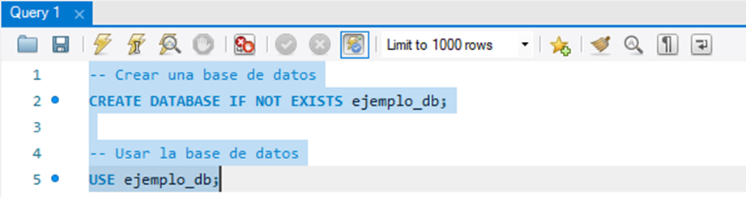
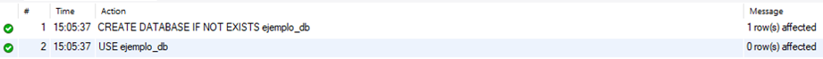
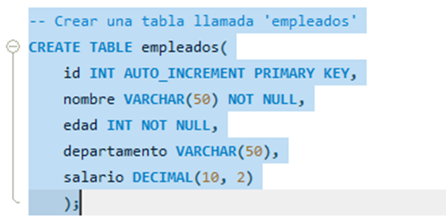
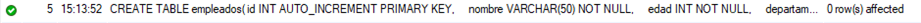
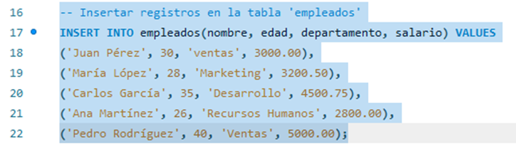

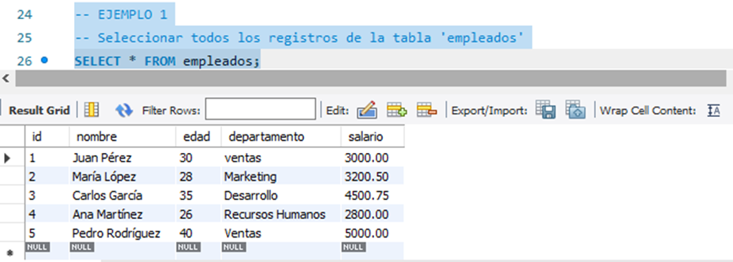
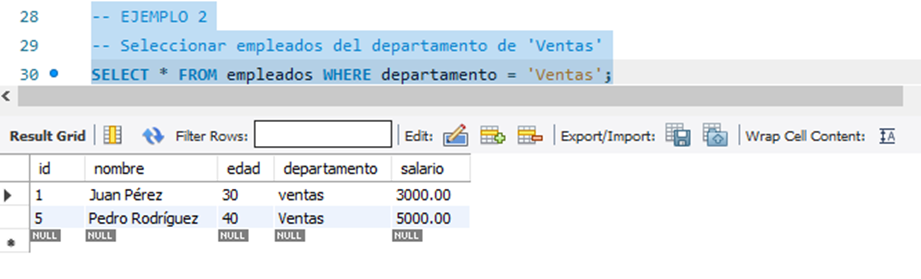
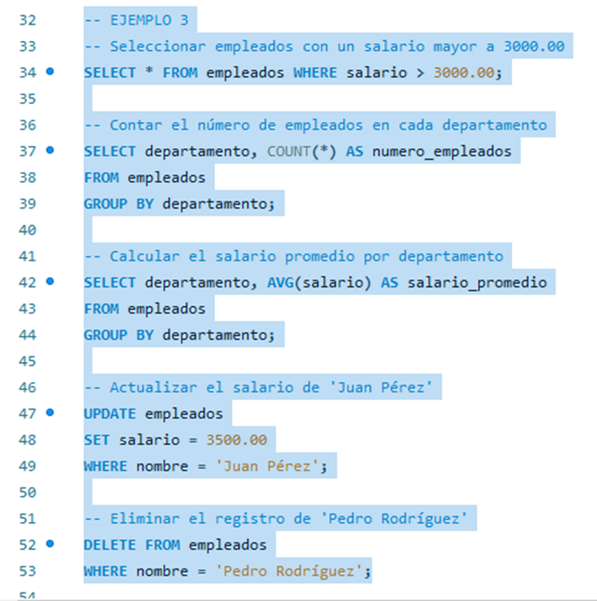
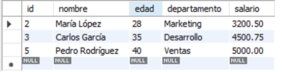
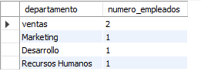
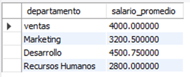