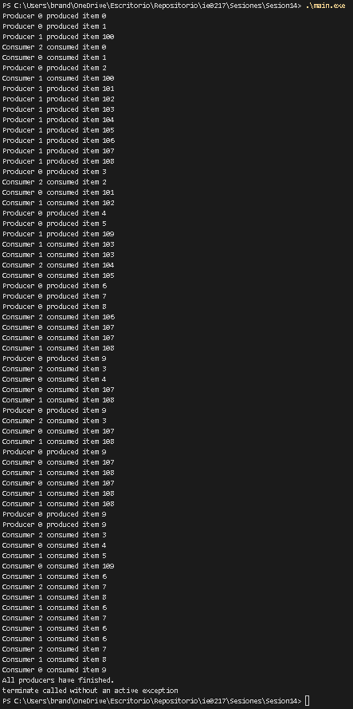

# Contenidos de la sesión 14


# Contenidos sobre Programación Paralela y Concurrente

- Procesos e Hilos
   - Definición y características de procesos e hilos.

- Multitarea
   - Definición y características de multitarea.

- Paralelismo vs Concurrencia
   - Diferencias entre paralelismo y concurrencia.

- Procesadores multinúcleo y multiprocesador
   - Descripción y diferencias entre procesadores multinúcleo y multiprocesadores.

- Memoria compartida vs Memoria distribuida
   - Comparación entre arquitecturas de memoria compartida y distribuida.

- Modelos de Programación
   - Modelo de memoria compartida.
   - Modelo de paso de mensajes.

- Condiciones de carrera
   - Definición y ejemplos de condiciones de carrera.
   - Consecuencias y cómo evitarlas.

- Sincronización de hilos
   - Importancia de la sincronización.
   - Mecanismos comunes: Mutex, semáforos, variables de condición, barreras.

- Bloqueos y Deadlocks
   - Definición de bloqueos y deadlocks.

- Costos asociados a la creación y administración de hilos
   - Impactos en el rendimiento por la creación y cambio de contexto.

- Consideraciones de rendimiento
   - Optimización del número de hilos, granularidad de tareas, y uso de recursos del sistema.

- Ejemplos prácticos de uso de sincronización
   - Uso de mutex, semáforos y variables de condición en un ejemplo práctico de productores y consumidores.


# Ejemplo de la sesión:

```cpp
#include <iostream>
#include <thread>
#include <vector>
#include <queue>
#include <mutex>
#include <condition_variable>
#include <semaphore> // Disponible en C++20
#include <chrono>

using namespace std;

constexpr int BUFFER_SIZE = 10;
std::queue<int> buffer;
std::mutex mtx;
std::condition_variable cv_producer, cv_consumer;
std::counting_semaphore<BUFFER_SIZE> empty_slots(BUFFER_SIZE); // Inicializado con BUFFER_SIZE
std::counting_semaphore<BUFFER_SIZE> full_slots(0); // Inicializado con 0

void producer(int id, int num_tasks) {
    for (int i = 0; i < num_tasks; ++i) {
        // Produce an item (this is just a dummy item)
        int item = id * 100 + i;
        empty_slots.acquire(); // Decrementa el contador de slots vacíos

        // Critical section
        {
            std::lock_guard<std::mutex> lock(mtx);
            buffer.push(item);
            std::cout << "Producer " << id << " produced item " << item << std::endl;
        }

        full_slots.release(); // Incrementa el contador de slots llenos
        cv_consumer.notify_one(); // Notifica a un consumidor
    }
}

void consumer(int id) {
    while (true) {
        full_slots.acquire(); // Decrementa el contador de slots llenos
        std::unique_lock<std::mutex> lock(mtx);

        // Espera hasta que haya un ítem en el buffer
        cv_consumer.wait(lock, [] { return !buffer.empty(); });

        int item = buffer.front();
        buffer.pop();
        std::cout << "Consumer " << id << " consumed item " << item << std::endl;

        lock.unlock();
        empty_slots.release(); // Incrementa el contador de slots vacíos
        cv_producer.notify_one(); // Notifica a un productor

        // Simulate processing time
        std::this_thread::sleep_for(std::chrono::milliseconds(100));
    }
}

int main() {
    const int num_producers = 2;
    const int num_consumers = 3;
    const int num_tasks_per_producer = 10;

    std::vector<std::thread> producers, consumers;

    // Create producer threads
    for (int i = 0; i < num_producers; ++i) {
        producers.emplace_back(producer, i, num_tasks_per_producer);
    }

    // Create consumer threads
    for (int i = 0; i < num_consumers; ++i) {
        consumers.emplace_back(consumer, i);
    }

    // Join producer threads
    for (auto& producer_thread : producers) {
        producer_thread.join();
    }

    // Allow consumers to finish processing
    std::this_thread::sleep_for(std::chrono::seconds(2));

    // Ideally, we would signal consumers to stop, but for simplicity we just exit
    std::cout << "All producers have finished." << std::endl;

    return 0;
}
```

# Pasos para ejecutar el código:

## Instrucciones

Intrucciones para correr el código.

### Paso 1.

Accesar a la terminal.

### Paso 2.

Ir al directorio de los códigos.

```bash
cd <direccion>
```

### Paso 2.

Crear un archivo ejecutable(.exe) y compilar el código.

```bash
g++ -std=c++20 -o .\<nombre_ejecutable.exe> .\<nombre_archivo_codigo.cpp>
```

### Paso 3.

Correr el archivo ejecutable creado.

```bash
.\<nombre_ejecutable.exe>
```

# Código ejecutado:
