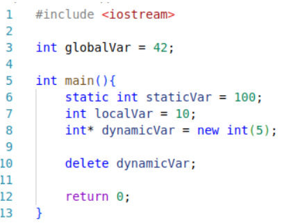

# **Tarea 3**

## **Instrucciones**

Intrucciones para correr el código.

### Paso 1.

Accesar a la terminal.

### Paso 2.

Ir al directorio del los archivos, específicamente donde se encuentra el Makefile, digitando en la terminal:

```bash
cd <direccion>
```

### Paso 3.

Correr el archivo Makefile creado, digitando en la terminal:

#### En Windows

```bash
mingw32-make
```

#### En Linux

```bash
make
```

### Paso 4.

Interactuar con los programas.

## **Parte Teórica**

1. Sección del nivel de usuario de la memoria.

    - Secciones:
        - Text:
        Esta sección de memoria almacena el código ejecutable, es para solo lectura por lo cual no se modifica durante la ejecución.

        - Constants:
        Almacena los valores constantes a usar durante la ejecución del código y es para solo lectura.

        - Global and Static Variables:
        En esta sección es en la que se almacenan la variables globales y estáticas. Duran lo que este activo el programa.

        - Heap:
        Esta sección es para la memoria dinámica, destinada a que el programador o usuario asigne memoria durante la ejecución del programa. La memoria crece hacia arriba (hacia direcciones de memoria más altas).

        - Stack:
        Almacena la variables locales, direcciones de retorno, parámetros de funciones, etc. Se asigan automaticamente. La memoria crece hacia abajo (hacia direcciones de memoria más bajas).

    - Secciones dinámicas: Heap y Stack.

2. Variables en el código.

    

    - globalVar: se almacena en la sección Global and Static Variables, porque la existencia de la variable es igual a la ejecución del programa.

    - staticVar: se almacena en la sección Global ans Static Variables, se guarda en esa sección aunque se defina dentro de una función porque se define como variable estática.

    - localVar: se almacena en la sección Stack, porque se define dentro de una función.

    - dynamicVar: se almacena en la sección Heap, porque se reserva memoria dinámica para la variable.

3. Diferencia entre memoria dinámica y memoria estática.

    La memoria estática se asigna cuando se compila y dura toda la ejecución del programa, en cambio, la memoria dinámica se asigna en tiempo de ejecución y se debe liberar manualmente.

    - Estática:
    ```cpp
    static int staticVar = 100; // Memoria estática
    ```

    - Dinámica:
    ```cpp
    int* dynamicVar = new int(5);  // Memoria dinámica
    delete dynamicVar;  // Libera memoria
    ```

4. Acceso a memoria Heap.

    ```cpp
    int main() {
    // Se reserva memoria luego se declara la variable
    int* dynamicVar = new int;  
    *dynamicVar = 10;

    // Imprimir el valor almacenado
    cout << "Valor: " << *dynamicVar << endl;

    // Libera la memoria que se reservó
    delete dynamicVar;  

    return 0;
    }

5. Importancia de liberar la memoria dinámica.

    Liberar la memoria evita fugas de memoria, mejora el rendimiento y previene fallos del programa por capacidad de memoria alcanzada.

6. Funciones malloc, calloc y realloc.

    - malloc: reserva memoria sin declarar. Parámetros(Tamaño en bytes)
    - calloc: reserva memoria declarada en 0. Parámetros(Número de elementos, tamaño en bytes cada elemento)
    - realloc: cambia la cantidad de memoria reservada de un bloque asignado. Parámetros(Puntero al bloque, nuevo tamaño en bytes)

7. Diferencia entre free y delete.

    - free es usada para liberar memoria asignada con malloc, calloc y realloc. 
    - delete es usada para liberar memoria asignada con new.

    Un ejemplo para usar free es reservar memoria para una variable y para delete es reservar memoria para un objeto o tipo.

8. Diferencia entre new y malloc.

    new asigna memoria e inicializa, en cambio, malloc solo asigna memoria no inicializa.

    - new se usa cuando se trabaja con objetos.
    - malloc se usa cuando solo se necesita reservar memoria sin inicializar.

9.  Punteros inteligentes

    Estos punteros son como los punteros tradicionales pero manejan la memoria automaticamente(asignación y liberación).

    - Ejemplo:
        ```cpp
        #include <memory>
        #include <iostream>

        using namespace std;

        int main() {
            unique_ptr<int> ptr = make_unique<int>(13);  // Asigna un entero en memoria
            cout << *ptr << endl;  // Imprime 13
            return 0;
        }
        ```
    
    - Ejemplo:
        ```cpp
        #include <memory>
        #include <iostream>

        using namespace std;

        int main() {
            shared_ptr<int> ptr1 = make_shared<int>(13);  // Puntero que se puede compartir
            shared_ptr<int> ptr2 = ptr1;  // Ahora ambos apuntan al mismo bloque de memoria
            cout << *ptr2 << endl;  // Imprime 13
            return 0;
        }
        ```

10. Algoritmo.

    Es un proceso generalizado para resolver una tarea o problema en específico.

    Caracteristicas:

    - Entradas y salidas definidas.
    - Claridad en el algoritmo para no haya ambiguedades.
    - Manera más eficiente de resolver para usar de manera óptima los recursos limitados.
    - Generalidad, la manera de resolver no debe estar ligada exclusivamente a programación.

11. Complejidad y eficiencia.

    La complejidad es es la cantidad de recursos que se necesita en el algoritmo para correr. La eficiencia es la capacidad del algoritmo de usar la menor cantidad de recursos posibles.

    Se miden con notaciones:

    - Notación Big-O: limite superior de la cantidad de tiempo que el algoritmo podría requerir. (Peor caso)
    - Notación Omega: limite inferior de la cantidad de tiempo que el algoritmo podría requerir. (Mejor caso)
    - Notación Theta: limites superior e inferior de la cantidad de tiempo que el algoritmo podría requerir. (Promedio)

12. Estructuras lineales y no lineales.

    En las estructuras lineales los datos estan juntos, uno despues del otro, o sea se acomodan secuenciamente. En cambio, las estruturas no lineales, pueden estar organizados de diferentes maneras no secuenciales.

    Ejemplos lineales:
    - Arreglos.
    - Pilas.

    Ejemplos no lineales:
    - Arboles.
    - Grafos.

13. Funcionamiento de Stack.

    La estructura es lineal por lo cual los elementos se acomodan de manera secuencial y siguen el funcionamiento de LIFO que sifnifica que el último en entrar es el primero en salir. Para ello se usan las operaciones relacionadas al stack: pop, push, peek, isEmpty e isFull.

14. Funcionamiento Queue.

    La estructura es lineal por lo cual los elementos se acomodan de manera secuencial y siguen el funcionamiento FIFO que significa que el primero en entrar es el primero en salir. Para ello se usan las operaciones relacionadas a la queue: enqueue, dequeue, peek, isEmpty e isFull.

15. Funcionamiento Lista Enlazada.

    La estructura es lineal por lo cual los elementos se acomodan de manera secuencial por medio de nodos. Cada nodo esta compuesto de un dato y un puntero al siguiente elemento de la lista. Hay diferentes tipos de listas enlazadas: simplemente enlazada, doblemente enlazada  y circularmente enlazada. Para ello se usan operaciones relacionadas a la lista enlazada: inserción, eliminación y busqueda.

16. Funcionamiento Árbol.

    La estructura es no lineal por lo cual los elementos no se acomoda de manera secuencias sino jerárquica por medio de nodos. Cada nodo esta compuesto de un dato y dos punteros a los nodos de un nivel inferior en el árbol.

    Carácteristicas:

    - Nodo: almacena dato y punteros.
    - Raíz: nodo más alto.
    - Arista: vínculo que conecta dos nodos.
    - Nodo hoja: nodo que no tiene punteros a otro nodo.
    - Altura: cantidad de aristas desde la raíz hasta la hoja mas profunda.
    - Bosque: varios arboles separados.

17. Tipos de recorrido de un árbol.

    - In-Order: subárbol izquierdo luego raíz y por último subárbol derecho.
    - Pre-Order: Primero raíz luego subárbol izquierdo y por último subárbol derecho.
    - Post-Order: Primero subárbol izquierdo luego subárbol derecho y por último raíz.

18. Diferencia entre árbol y árbol binario.

    Un árbol es una estructura jerárquica compuesta por nodos y cada dodo puede tener varias aristas, pero el árbol binario esta compuesta por nodos y cada nodo puede tener dos aristas asociadas.

    Tipos de árboles binarios:

    - Completo: Todos los niveles que tiene el árbol estan llenos y puede que excepto el último nivel pero sí ocupado alineado a izquierda.
    - Perfecto: Todos los niveles que tiene el árbol estan llenos.
    - Lleno: Los nodos tienen dos hijos o ninguno.