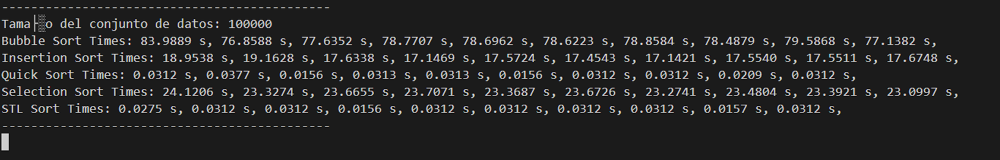

Benchmarks en algoritmos de ordenamiento

## **Instrucciones**

Intrucciones para correr el código.

### Paso 1.

Accesar a la terminal.

### Paso 2.

Ir al directorio del los archivos, específicamente donde se encuentra el Makefile, digitando en la terminal:

```bash
cd <direccion>
```

### Paso 3.

Correr el archivo Makefile creado, digitando en la terminal:

#### En Windows

```bash
mingw32-make
```

#### En Linux

```bash
make
```

### Paso 4.

Digitar en la terminal, si se quieren cantidades de datos predefinidas:

#### En Windows

```bash
mingw32-make run
```

#### En Linux

```bash
make run
```
### Paso 5.

Digitar en la terminal, si se quieren cantidades de datos diferentes a los predefinidos:

#### En Windows

```bash
mingw32-make run_args <arg1> <arg2> <arg3> <...>
```

#### En Linux

```bash
make run_args <arg1> <arg2> <arg3> <...>
```

## Página Web 

> [!NOTE]
> [Documentación generada por Doxygen como una página web](https://benchmarks-algoritmos-ordenamiento.netlify.app/)

## Parte Teórica

1. **¿Qué es un algoritmo de ordenamiento y por qué son importantes en programación?**  
   Son procedimientos para organizar datos. Son importantes para optimizar el rendimiento en grandes conjuntos de datos.

2. **Explique el funcionamiento del algoritmo de ordenamiento "Bubble Sort".**  
   Compara pares adyacentes y los intercambia si están en desorden, repitiendo hasta que no haya más intercambios.

3. **Explique el funcionamiento del algoritmo de ordenamiento "Selection Sort".**  
   Encuentra el mínimo en cada iteración y lo coloca en su posición correcta al inicio.

4. **Describa el algoritmo de ordenamiento "QuickSort". ¿Cuál es su ventaja principal sobre otros algoritmos de ordenamiento?**  
   Divide el conjunto en subarreglos alrededor de un pivote y los ordena. Es más rápido para grandes conjuntos de datos.

5. **Explique el concepto de complejidad temporal y cómo se aplica a los algoritmos de ordenamiento.**  
   Es una medida del tiempo de ejecución respecto al tamaño de datos que con el que se opera. En los algoritmos de ordenamiento la complejidad temporal se usa para evaluar qué tan eficientes son en ordenar diferentes tamaños de datos.

6. **¿Cuál es la diferencia entre los algoritmos de ordenamiento estables e inestables?**  
   Los algoritmos de ordenamiento estables preservan el orden relativo de elementos iguales pero en los algoritmos de ordenamiento inestables no.

7. **¿Cómo funciona la función std::sort de la STL y qué algoritmo de ordenamiento utiliza internamente?**  
   Internamente la función `sort` utiliza un algoritmo llamado **Introsort**, que es una combinación de QuickSort, HeapSort y Insertion Sort. La función funciona asi:
   
   - Comienza utilizando **QuickSort**.
   - Si la profundidad de la recursividad crece demasiado cambia a **HeapSort**.
   - Cuando el tamaño del conjunto es pequeño usa **Insertion Sort**.

8. **Explique la importancia de hacer benchmarks en los algoritmos de ordenamiento.**  
   Permite comparar el rendimiento en tiempo y memoria. Bajo condiciones como cantidad de datos y qué tan ordenados estan inicialmente los datos.

9. **Compare el uso de memoria de diferentes algoritmos de ordenamiento.**  

   - **Bubble Sort**: Uso de memoria O(1), ya que es un algoritmo **in-place**, lo que significa que no requiere memoria adicional más allá del arreglo original.

   - **Insertion Sort**: Uso de memoria O(1). También es un algoritmo **in-place**, solo utiliza memoria adicional para el almacenamiento temporal de un elemento durante la inserción.

   - **Selection Sort**: Uso de memoria O(1). Es un algoritmo **in-place** y no requiere memoria extra más allá del conjunto de datos original.

   - **QuickSort**: Uso de memoria O(log n) en promedio, debido a la recursión en el proceso de partición. En el peor caso, si no está optimizado, puede llegar a usar O(n) memoria adicional.

   - **Merge Sort**: Uso de memoria O(n). Es un algoritmo **no in-place**, ya que requiere un arreglo auxiliar para fusionar los subarreglos, lo que consume memoria adicional equivalente al tamaño del conjunto de datos.

   - **Heap Sort**: Uso de memoria O(1), ya que es **in-place** y no necesita un arreglo auxiliar adicional, solo un espacio extra constante para las operaciones internas.

   - **std::sort** (de la STL): Uso de memoria O(log n), similar a QuickSort, debido a la recursividad, pero es eficiente en el uso de memoria en comparación con Merge Sort.


10. **¿Cómo se elige el algoritmo de ordenamiento más adecuado para un conjunto de datos dado?**  
    Depende del tamaño, orden inicial y si se necesita estabilidad.

11. **Nombre cinco contenedores diferentes de la STL y explique brevemente en qué situaciones sería apropiado usar cada uno.**  
    - **vector**: Para almacenar elementos en un array dinámico, de tamaño variable.
    - **list**: Para listas enlazadas donde se realizan muchas inserciones o eliminaciones.
    - **deque**: Para agregar o quitar elementos tanto al principio como al final eficientemente.
    - **set**: Para almacenar elementos únicos, ordenados automáticamente.
    - **map**: Para pares clave-valor, útil en búsquedas rápidas por clave.

12. **Explique qué son los adaptadores de contenedores y brinde un ejemplo para el cual se podría implementar.**

    Son interfaces que modifican el comportamiento de otros contenedores, como **stack** (LIFO) o **queue** (FIFO). Ejemplo :  
    Un stack implementado sobre un deque se usaría en situaciones donde necesitas procesar elementos en orden inverso al que fueron agregados.


13. **Explique el concepto de iteradores en la STL y cómo se utilizan para acceder a elementos en contenedores.**  
    Los iteradores son punteros abstractos que permiten recorrer elementos en contenedores de manera uniforme. Se usan con estructuras como `vector`, `list` para acceder, modificar o iterar sobre los elementos.

14. **Mencione y explique 3 diferentes operaciones soportadas por iteradores en STL. ¿Cuál es la forma de definirlas en el código?**

   - **begin()**: Retorna un iterador al primer elemento.  
       ```cpp
       auto inicio = contenedor.begin(); 
       ```
   
   - **end()**: Retorna un iterador una posición más allá del último elemento).   
       ```cpp
       auto fin = contenedor.end(); 
       ```

   - **++ (incremento)**: Mueve el iterador al siguiente elemento. 
       ```cpp
       ++posicion;
       ```

   Estas son las tres operaciones y sus formas correspondientes en código C++.
``


15. **¿Qué implementaciones se pueden hacer con iteradores de acceso aleatorio? ¿Cuál es la diferencia principal con los iteradores bidireccionales?**  
    Los iteradores de acceso aleatorio permiten saltar a cualquier elemento, como en **vector**. Los iteradores bidireccionales solo permiten moverse hacia adelante y atrás, como en **list**.

16. **Proporcione ejemplos de al menos tres algoritmos de la STL y describa sus funciones básicas.**
   - **sort**: Ordena los elementos de un rango en orden ascendente por defecto pero se puede cambiar la comparación.
   - **count**: Cuenta cuántas veces aparece un valor específico en un rango de elementos.
   - **reverse**: Invierte el orden de los elementos en un rango especificado.

17. **¿Cómo podría utilizar un algoritmo personalizado con la STL?**  
    Las funciones de STL permiten pasar argumentos que modifican el funcionamiento predeterminado de la función de STL.

18. **¿Cuál es el papel de los templates en la implementación de funciones de ordenamiento?**  
    Permite a las funciones de ordenamiento ser genéricas para trabajar con diferentes tipos de datos.  

19. **Explique de qué forma se implementan Templates con múltiples parámetros en C++.**  
    Se declaran usando varias variables genéricas como argunentos de la función o clase. Ejemplo:  
    ```cpp
    template<typename T1, typename T2> 
    void funcion(T1 a, T2 b) { ... }
    ```

20. **¿Qué son las excepciones en C++ y cómo se pueden usar para manejar errores durante las operaciones de ordenamiento?**
    Las excepciones permiten que se actue en el programa de una manera determinada, cuando se genera un error al ejecutarse el codigo. Esto evita que el programa falle y se detenga.

    Durante las operaciones de ordenamiento, las excepciones pueden usarse para manejar errores como fallos de asignación de memoria, accesos fuera de los límites del array o entradas inválidas. El manejo de excepciones se realiza mediante los bloques `try`, `catch` y `throw`.

21. **Describa los bloques try, catch y throw y cómo se utilizan para el manejo de excepciones en C++.**
    - **try**: Bloque donde se ejecuta el código que podría generar una excepción.
    - **throw**: Lanza una excepción cuando ocurre un error.
    - **catch**: Captura y maneja la excepción.
  
    Se utilizan juntos para gestionar errores los errores.

22. **Nombre al menos tres excepciones estándar proporcionadas por C++ y proporciona ejemplos de situaciones en las que podrían ser útiles.**  
    - **bad_alloc**: Ocurre cuando falla la asignación de memoria.
    - **out_of_range**: Se lanza al acceder a un índice fuera de los límites en un contenedor.
    - **invalid_argument**: Se utiliza cuando un argumento inválido es pasado a una función.

23. **¿Cuál es la forma de manejar errores inesperados o no considerados durante la elaboración del código?**  
    Usando el bloque `catch(...)` captura cualquier excepción de manera genérica.

24. **Describa cómo las expresiones regulares se pueden usar para validar o filtrar datos antes del ordenamiento.**  
    Las expresiones regulares permiten verificar si los datos cumplen con un patron específico antes de ordenarlos.
    Un ejemplo seria cuando el programa recibe datos de un archivo o usuario, entonces se tiene que verificar si la información entrante es valida para el proposito solicitado.

25. **Enumere al menos tres caracteres especiales comúnmente utilizados en expresiones regulares y describa sus funciones.**  
    - **^**: Indica el inicio de una cadena.
    - **$**: Indica el final de una cadena.
    - **.**: Representa cualquier carácter (excepto saltos de línea).

26. **¿Cuál es la diferencia entre std::regex_match y std::regex_search en C++?**  
    - **regex_match**: Verifica si toda la cadena coincide con la expresión regular.
    - **regex_search**: Busca si alguna parte de la cadena coincide con la expresión regular.

27. **¿Cómo se puede utilizar std::regex_replace en C++ para modificar cadenas de texto?**  
    `regex_replace` busca y reemplaza partes de una cadena que coinciden con una expresión regular.
    ```cpp
    string resultado = regex_replace(texto, regex(patron), reemplazo);
    ```

28. **¿Qué es un Makefile y cómo se puede usar para automatizar la compilación de un programa en C++ con múltiples algoritmos de ordenamiento?**  
    Un **Makefile** es un archivo de configuración que define cómo compilar y enlazar un programa. Se usa para proyectos con múltiples archivos fuente y algoritmos. Un Makefile puede incluir reglas para compilar cada archivo de manera independiente y combinar la compilación en un ejecutable.

    Para escribir un Makefile que compile diferentes algoritmos de ordenamiento se escriben reglas diferentes para compilar los archivos fuente y se crean ejecutables distintos para cada algoritmo.


# Graficas generadas con 10 iteraciones:


### Datos generados en las 10 iteraciones:





